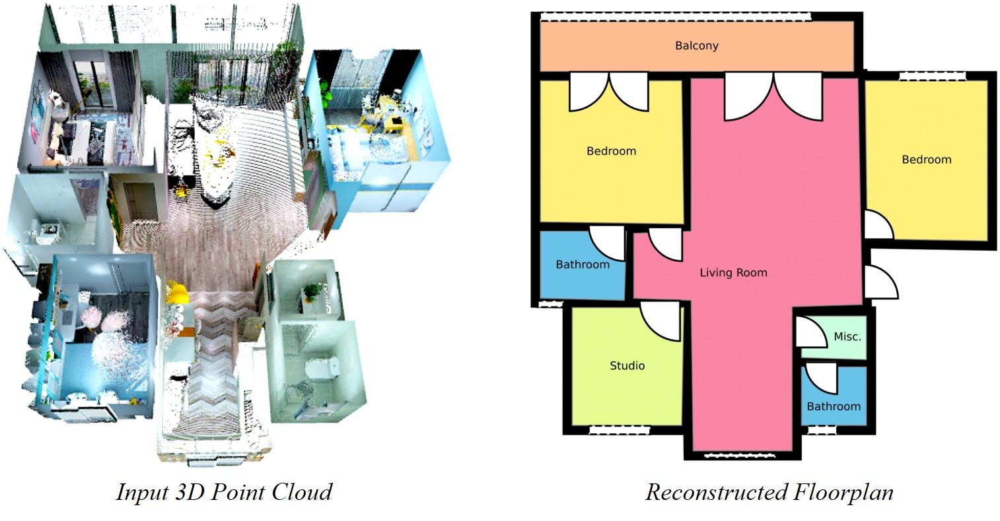

## Connecting the Dots: Floorplan Reconstruction Using Two-Level Queries


<div align="center">
<a href="https://n.ethz.ch/~yuayue/">Yuanwen Yue</a><sup>1</sup>, <a href="https://theodorakontogianni.github.io/">Theodora Kontogianni</a><sup>1,2</sup>, <a href="https://igp.ethz.ch/personen/person-detail.html?persid=143986">Konrad Schindler</a><sup>1</sup>, <a href="https://francisengelmann.github.io/">Francis Engelmann</a><sup>1,2</sup>

<sup>1</sup>ETH Zurich <sup>2</sup>ETH AI Center





</div>


This repository provides code, data and pretrained models for **RoomFormer**, a Transformer model for floorplan reconstruction.

[[Project Webpage](https://ywyue.github.io/RoomFormer/)]    [[Paper (Coming soon)](https://github.com/ywyue/RoomFormer)]

***Code coming soon, stay tuned!***

### Citation
```
@article{yue22connect,
  author    = {Yue, Yuanwen and Kontogianni, Theodora and Schindler, Konrad and Engelmann, Francis},
  title     = {{Connecting the Dots: Floorplan Reconstruction Using Two-Level Queries}},
  journal   = {ArXiv},
  year      = {2022},
}
```